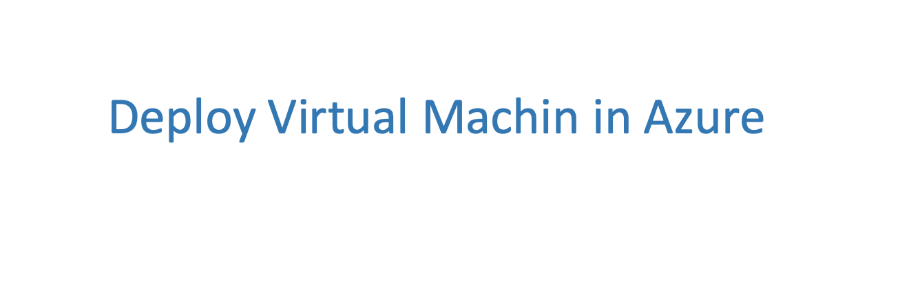
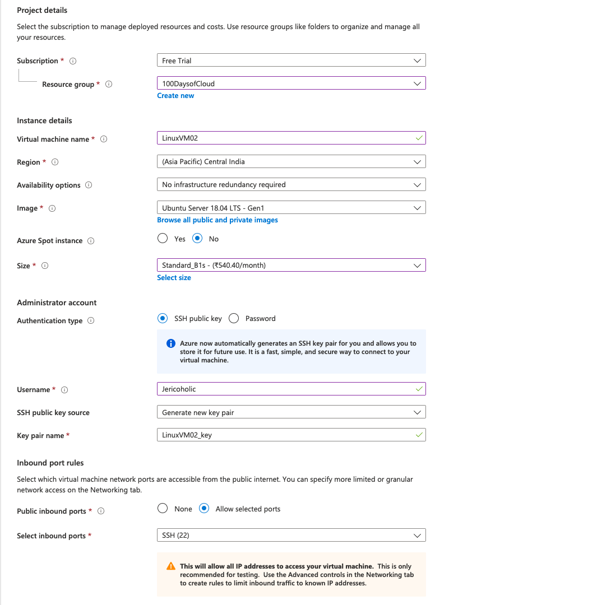
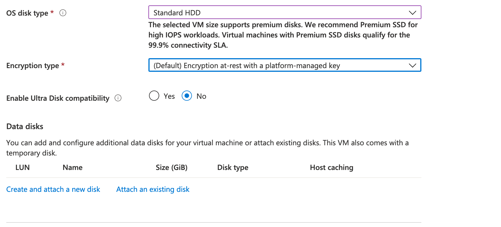
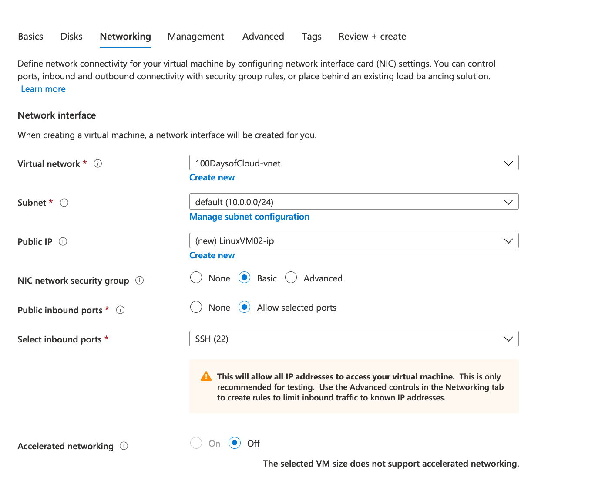
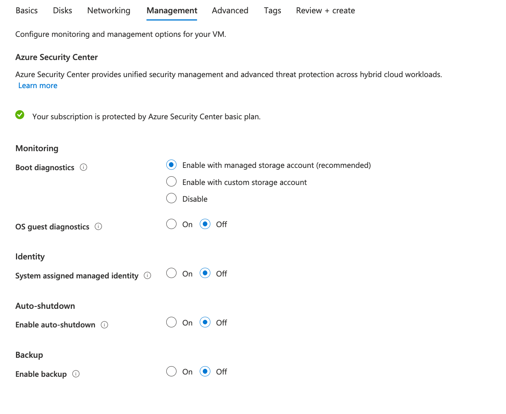
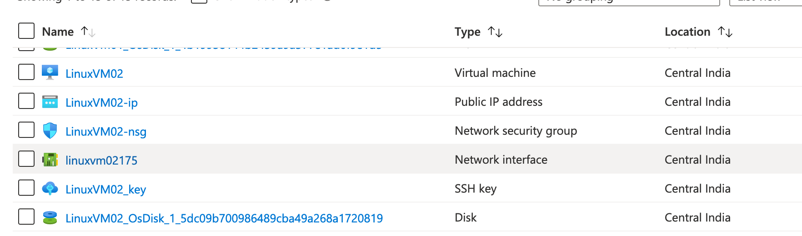
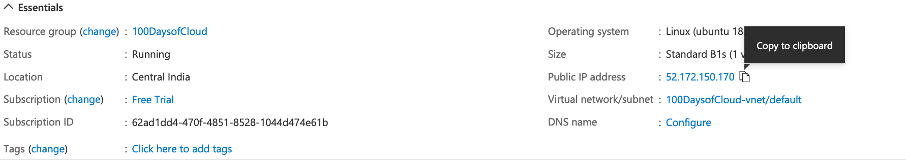
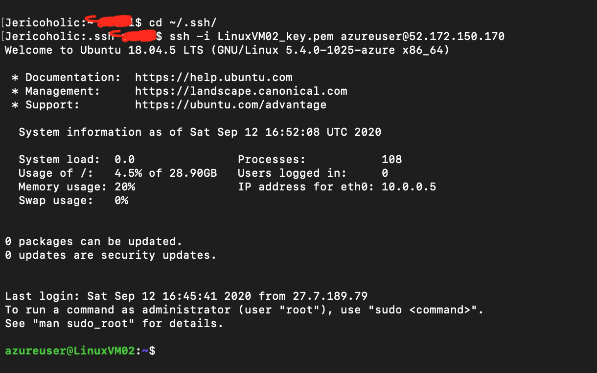

**Add a cover photo like:**

Deploy a Virtual Machine in Azure

## Introduction

Delpoying Linux VM in Azure to study for LCFS exam.

## Prerequisite

An Azure subscription and administrator permissions to deploy resource groups, virtual networks, and virtual machines.

## Instruction

Navigate to https://portal.azure.com and log in with your administrator account. On the portal homepage, click on Virtual Machine and Add Virtual Machine.

In the Basic tab of the wizard, fill out the following information:

1.	Select the Subscription to charge the cost of resources against (I'm using Free Tier account).
2.	Select an existing resource group or create a new one.
3.	Name the virtual machine.
4.	Select a region to host the virtual machine and its resources.
5.	For availability options, this is just a demo virtual machine, so no redundancy is required.
6.	For the image, I'm going to select Ubuntu 18.04, but you can choose any operating system you want.
7.	Select No for the Azure Spot instance
8.	For the size, choose something small to limit the cost of the virtual machine, so I'm going with B1s for 1 core and 1GB RAM
9.	Now it's time to set up the Administrator account.I'm going to use a SSH to authenticate to my Linux VM.
10.	Finally, choose inbound port rules. Typically you don't want virtual machines to have direct Internet access.I'll choose to allow SSH on port 22 so I can remote directly to it.

Continue onto the Disks tab. Here we'll keep it simple. I'll change the OS Disk Type to Standard HDD just to save a bit on storage costs.

Continue onto the Networking tab. Since I don't have any existing virtual networks, I'm going to keep this all at the defaults, including a public IP address so I can access my virtual machine directly over the Internet. Typically not a best practice, but again, this VM is for learning purposes, so I'm not getting fancy yet.

Overview of network configuration:

Continue onto the Management tab. I will make one small change here and that is to disable boot diagnostics.

Overview of management configuration:

Skip over to the Review + create tab and verify it passes validation. If it does, select Create at the bottom. Once the deployment is complete, go back to the newly created resource group and see the different resources created:

1.Virtual network that currently has a single subnet configured
2.The virtual machine compute resource
3.Public IP address for the virtual machine
4.Network security group that currently allows port 22 for SSH
5.A separate network interface that attaches to the virtual network
6.Operating system disk

Selecting the virtual machine, in the top overview section there will be the current public IP address so I can connect to the virtual machine directly. Here it is 52.172.150.170:

Select the Connect button and it will give you instructions on connecting to the virtual machine with a private key. 

## Social Proof

✍️ Show that you shared your process on Twitter or LinkedIn

[link](https://twitter.com/Jericoholic5/status/1304828078351200258)
